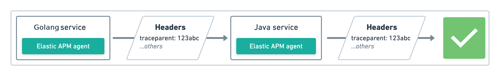

# ELASTIC APM - GOLANG AGENT 

### [Distributed-tracing](https://www.elastic.co/guide/en/apm/get-started/current/distributed-tracing.html#_why_is_distributed_tracing_important)
End-to-end analysis performance throughout microservice by tracing entire of a request.

**Propagation**

- It will inject a traceparent into HTTP header outgoing requests.
- Incoming requests will check HTTP header tracing metadata to get **trace-id**. If it exists, it adds child span to parent span, if not it creates a new span.

#### Compose

Run docker-compose up. Compose will download the official docker containers and start Elasticsearch, Kibana, and APM Server.

#### SERVER

Add apmhttp wrapper for middleware handler
```golang
http.ListenAndServe(":8080", apmhttp.Wrap(mux))
```

#### CLIENT

Add apmhttp client wrapper for http request
```golang
client := apmhttp.WrapClient(http.DefaultClient)
```

#### Visualize

Use the APM app at http://localhost:5601/app/apm to visualize your application performance data!

